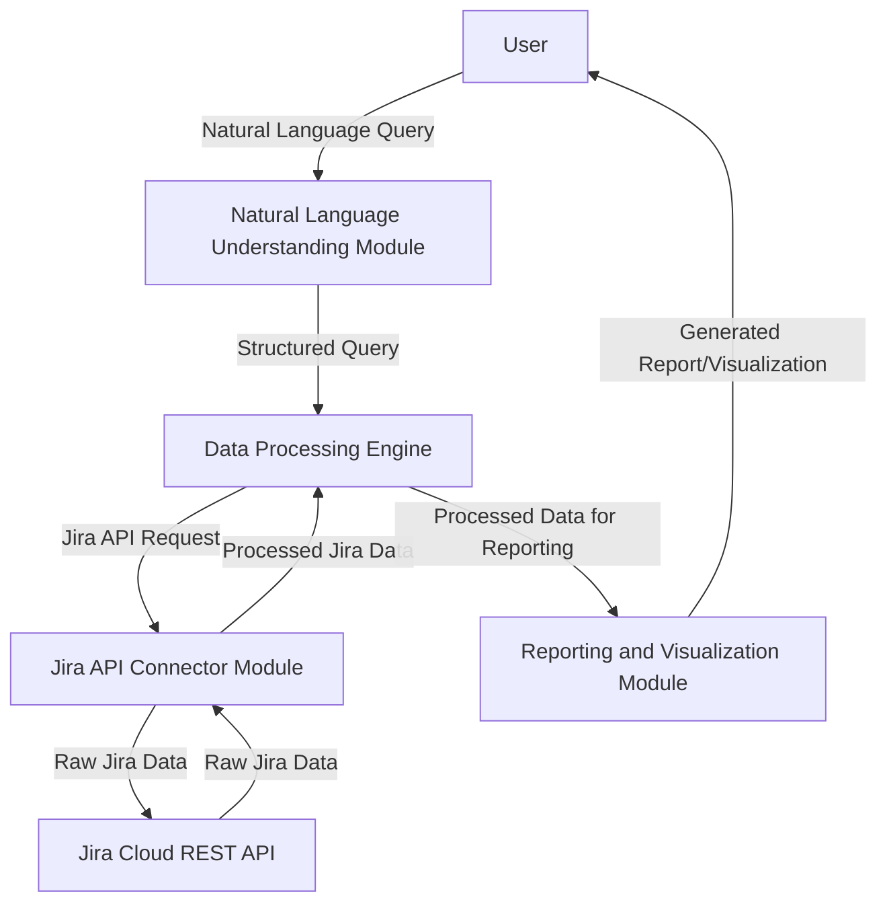

# AI Agent for Advanced Jira Reporting: Architectural Design

## 1. Introduction

This document outlines the architectural design for an AI agent aimed at providing granular and customized reporting from Jira through a natural language interface. The agent will address the limitations of native Jira reporting and enhance analytical capabilities for enterprise software engineering departments. This design focuses on defining the core components, their interactions, the data flow, and the specifications for the natural language interface.

## 2. Core Components of the AI Agent

The AI agent will consist of several interconnected modules, each responsible for a specific set of functionalities. These modules are designed to ensure modularity, scalability, and maintainability of the system.

### 2.1. Natural Language Understanding (NLU) Module

This module is the primary interface for user interaction. Its main responsibility is to interpret natural language queries from users and convert them into structured, machine-readable commands or data requests. This involves:

- **Intent Recognition**: Identifying the user's goal or intention (e.g., 

"get assignee ticket counts", "show defect trends", "compare sprint velocities").
- **Entity Extraction**: Identifying key entities within the query, such as project names, user names, date ranges, issue types, and specific metrics.
- **Query Normalization**: Converting variations in natural language (e.g., "tickets assigned to John", "John's issues") into a standardized format.

### 2.2. Jira API Connector Module

This module is responsible for all interactions with the Jira Cloud REST API. It acts as a secure and efficient gateway to extract raw data from Jira based on the structured requests received from the NLU module or Data Processing Engine. Its functionalities include:

- **Authentication and Authorization Management**: Handling secure authentication with Jira (e.g., OAuth 2.0) and managing API tokens or credentials.
- **API Request Construction**: Dynamically building appropriate Jira API requests (e.g., JQL queries for issue search, requests for user data, custom field metadata) based on the structured input.
- **Data Retrieval**: Executing API calls and handling responses, including pagination and error handling.
- **Rate Limiting and Throttling**: Implementing mechanisms to respect Jira API rate limits and prevent abuse or blacklisting.
- **Data Pre-processing**: Performing initial, lightweight cleaning or structuring of raw JSON responses from Jira before passing them to the Data Processing Engine.

### 2.3. Data Processing Engine

This module is the central hub for transforming raw Jira data into a format suitable for analysis and reporting. It will handle complex data manipulation, aggregation, and calculation of advanced metrics. Key responsibilities include:

- **Data Transformation**: Converting raw Jira data into a standardized internal data model.
- **Data Aggregation**: Performing aggregations across issues, projects, and timeframes to calculate metrics like total ticket counts, average resolution times, or sprint velocities.
- **Metric Calculation**: Computing advanced metrics such as lead time, cycle time, defect density, re-opened defect rates, and other custom metrics based on the defined reporting requirements.
- **Historical Data Management**: Potentially managing a local cache or a lightweight data store for historical Jira data to facilitate trend analysis and reduce repeated API calls for static historical data.
- **Error Handling and Validation**: Ensuring data integrity and handling cases of missing or malformed data.

### 2.4. Reporting and Visualization Module

This module is responsible for generating human-readable reports and interactive visualizations based on the processed data. It will present the insights derived from Jira data in a clear and intuitive manner. Its functions include:

- **Report Generation**: Creating structured reports in various formats (e.g., tables, summaries, textual explanations).
- **Visualization Generation**: Producing different types of charts and graphs (e.g., bar charts for assignee counts, line graphs for velocity trends, pie charts for defect distribution).
- **Customizable Dashboards**: Allowing users to create and customize dashboards with various report widgets.
- **Export Capabilities**: Providing options to export reports and visualizations in common formats (e.g., PDF, CSV, PNG).

## 3. Data Flow and Interaction

The following diagram illustrates the high-level data flow and interaction between the core components:

**Detailed Data Flow Steps:**

1.  **User Input**: The user submits a natural language query (e.g., "Show me the number of open bugs per assignee in Project X for the last quarter").
2.  **NLU Processing**: The NLU module receives the query, identifies the intent ("show open bugs per assignee"), and extracts entities ("Project X", "last quarter"). It then translates this into a structured query (e.g., `{'intent': 'assignee_bug_count', 'project': 'Project X', 'time_range': 'last_quarter'}`).
3.  **Data Processing Request**: The structured query is sent to the Data Processing Engine.
4.  **Jira API Interaction**: The Data Processing Engine determines what data is needed from Jira. It instructs the Jira API Connector to fetch the relevant data (e.g., issues from Project X with status 'Open' and type 'Bug', and user data for assignees). The Jira API Connector constructs and executes the appropriate JQL queries and API calls.
5.  **Raw Data Retrieval**: The Jira API Connector receives raw JSON data from the Jira Cloud REST API.
6.  **Data Transformation and Calculation**: The Jira API Connector performs initial data pre-processing and passes the data to the Data Processing Engine. The Data Processing Engine then transforms this raw data, aggregates it (e.g., counts bugs per assignee), and calculates any required metrics.
7.  **Reporting and Visualization**: The processed and calculated data is sent to the Reporting and Visualization Module.
8.  **Output Generation**: The Reporting and Visualization Module generates the requested report (e.g., a table showing assignee names and their open bug counts) and/or a visualization (e.g., a bar chart).
9.  **User Output**: The generated report and/or visualization is presented to the user.

## 4. Natural Language Interface Design

The natural language interface will be designed to be intuitive and flexible, allowing users to ask questions in a conversational manner. The goal is to minimize the need for users to learn specific commands or syntax.

### 4.1. Input Format

Users will interact with the AI agent by typing their queries in plain English. The interface will be a text-based input field, similar to a chat application.

**Examples of Expected User Queries:**

-   "How many tickets are assigned to John Doe?"
-   "Show me the velocity of Team Alpha for the last 3 sprints."
-   "What are the top 5 defect types in Project Beta this month?"
-   "Give me a breakdown of issue statuses in the current sprint for Project Gamma."
-   "Compare the lead time of features completed in Q1 vs Q2."
-   "List all re-opened bugs in Project Delta from last year."
-   "Generate a burndown chart for Sprint 10 of Project Epsilon."

### 4.2. Desired Output Format

The output will be a combination of textual summaries, tables, and visual charts, depending on the nature of the query. The output should be clear, concise, and actionable.

-   **Textual Summaries**: For simple queries, a direct answer in text format (e.g., "John Doe has 15 tickets assigned.").
-   **Tables**: For detailed data breakdowns, tabular reports will be generated (e.g., a table showing assignee, issue count, and issue types).
-   **Visualizations**: For trends, comparisons, and distributions, appropriate charts will be generated (e.g., bar charts, line graphs, pie charts).
-   **Interactive Elements**: Where applicable, visualizations will include interactive elements like tooltips on hover, drill-down capabilities, and filtering options.

## 5. Challenges and Solutions for Natural Language Processing

Processing natural language in the context of technical Jira terms and reporting metrics presents several challenges. Addressing these will be crucial for the agent's accuracy and usability.

### 5.1. Ambiguity and Synonymy:

-   **Challenge**: Users may use different phrases to refer to the same concept (e.g., "bugs", "defects", "issues of type bug") or ambiguous terms (e.g., "last month" could mean calendar month or last 30 days).
-   **Solution**: Develop a comprehensive lexicon of Jira-specific terms, synonyms, and common reporting phrases. Implement context-aware NLU models that can disambiguate queries based on the project, user, and historical context. Allow users to clarify ambiguous queries through follow-up questions.

### 5.2. Technical Jargon and Custom Fields:

-   **Challenge**: Jira instances often have custom fields, issue types, and workflows that are unique to an organization. Users will expect to query these custom elements.
-   **Solution**: The NLU module must be able to dynamically learn or be configured with the custom metadata from the Jira instance (e.g., custom field names, their types, and possible values). This can be achieved by periodically fetching Jira metadata via the Jira API Connector and updating the NLU model's knowledge base.

### 5.3. Complex Query Structures:

-   **Challenge**: Users may ask complex questions involving multiple conditions, aggregations, or comparisons (e.g., "Show me the average time spent on resolved issues in Project A that were created by Team B in Q3 and had a priority of High or Critical").
-   **Solution**: Utilize advanced NLU techniques, possibly involving semantic parsing or dependency parsing, to break down complex queries into smaller, manageable components. Design a robust query interpretation logic that can handle nested conditions and aggregate functions. For very complex queries, the agent might ask clarifying questions or suggest simpler alternatives.

### 5.4. Time-based Queries:

-   **Challenge**: Interpreting relative time references (e.g., "last week", "this sprint", "previous quarter") accurately.
-   **Solution**: Implement a sophisticated date and time parsing component that can resolve relative time expressions to absolute date ranges based on the current date and the Jira instance's sprint/version data. Allow users to specify exact date ranges if needed.

### 5.5. Performance Considerations:

-   **Challenge**: Natural language queries can translate into complex Jira API calls that might be slow for large datasets.
-   **Solution**: Optimize JQL query generation. Implement caching mechanisms for frequently requested data. For very large data volumes, consider integrating with a data warehousing solution where pre-processed and aggregated data can be queried more efficiently. Provide feedback to the user if a query is expected to take a long time.

## 6. Conclusion

This architectural design provides a blueprint for building an intelligent AI agent for advanced Jira reporting. By focusing on robust NLU, efficient Jira API interaction, powerful data processing, and intuitive reporting, the agent will empower enterprise software engineering departments to unlock deeper insights from their Jira data through a natural language interface. The modular design ensures flexibility and extensibility for future enhancements and integrations.

