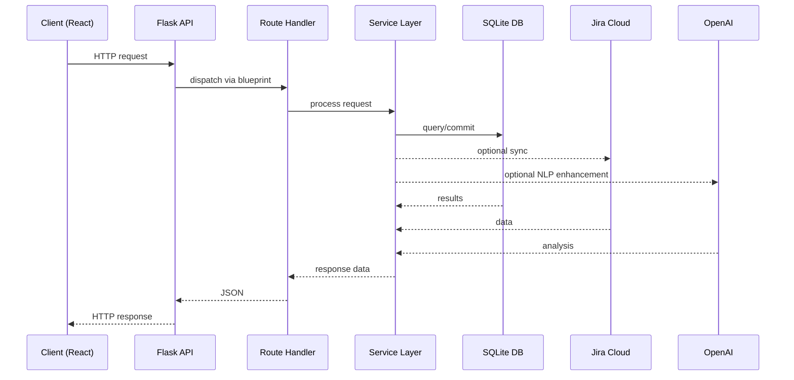

# Request Flow Overview

This document illustrates how a request travels from the JUNO dashboard to the database and back.  The Flask application defined in [`juno-agent/src/main.py`](../../juno-agent/src/main.py) registers several route blueprints which handle incoming API calls.

```python
app.register_blueprint(user_bp, url_prefix='/api')
app.register_blueprint(jira_bp, url_prefix='/api/jira')
app.register_blueprint(nlp_bp, url_prefix='/api/nlp')
app.register_blueprint(analytics_bp, url_prefix='/api/analytics')
app.register_blueprint(enhanced_nlp_bp, url_prefix='/api/enhanced-nlp')
```

A typical request from the React dashboard follows these steps:

1. **Client request** – The browser issues an HTTP call to one of the `/api/*` endpoints.
2. **Flask routing** – The request is dispatched to the appropriate blueprint function (for example `get_projects` in `jira_routes.py`).
3. **Service layer** – Route handlers call helpers such as `JiraDataExtractor` or `NaturalLanguageQueryProcessor` to execute business logic.
4. **Database access** – Services use SQLAlchemy models to read from or write to the SQLite database (`app.db`).
5. **Response** – Results are returned to the route handler and serialized as JSON back to the client.

Optional integrations such as Jira Cloud and OpenAI may be invoked by the service layer to refresh data or enhance query understanding.


