# JUNO: System Architecture
## Technical Design and Implementation Overview

---

## **Architecture Overview**

JUNO is built on a modern, scalable architecture that combines the power of conversational AI with enterprise-grade Jira analytics. The system employs a hybrid approach, utilizing both local natural language processing and cloud-based GPT enhancement to deliver optimal performance and cost efficiency.

### **High-Level Architecture**

```mermaid
graph TB
    User[👤 User] -->|Natural Language Query| UI[🎨 React Dashboard]
    UI -->|HTTP/REST| LB[⚖️ Load Balancer]
    LB -->|API Calls| Backend[🔧 Flask API Server]
    
    Backend -->|Query Processing| NLP[🧠 Hybrid NLP Engine]
    NLP -->|Simple Queries| Local[🏠 Local Processing]
    NLP -->|Complex Analysis| GPT[🤖 GPT Enhancement]
    
    Backend -->|Data Extraction| Jira[📊 Jira Cloud API]
    Backend -->|Analytics| Engine[⚡ Analytics Engine]
    Backend -->|Caching| Cache[💾 Redis Cache]
    Backend -->|Persistence| DB[🗄️ PostgreSQL]
    
    Engine -->|Visualizations| Charts[📈 Chart Generation]
    Charts -->|Interactive| Plotly[📊 Plotly.js]
    Charts -->|Static| MPL[📉 Matplotlib]
    
    GPT -->|Multi-Provider| OpenAI[🔵 OpenAI]
    GPT -->|Enterprise| Azure[🔷 Azure OpenAI]
    GPT -->|Custom| Enterprise[🏢 Enterprise GPT]
    
    Backend -->|Results| UI
    UI -->|Visualization| User
```



---

## **Core Components**

### **1. Frontend Dashboard (React)**

**Technology Stack:**
- React 18 with TypeScript
- Tailwind CSS for styling
- Vite for build tooling
- React Query for state management
- Chart.js/Plotly.js for visualizations

**Key Features:**
- Responsive design for desktop and mobile
- Real-time query processing interface
- Interactive data visualizations
- Export capabilities (PDF, CSV, PNG)
- Dark/light theme support

**Component Architecture:**
```
src/
├── components/
│   ├── QueryInterface/
│   ├── Analytics/
│   ├── Visualizations/
│   └── Common/
├── hooks/
├── services/
├── utils/
└── types/
```

### **2. Backend API (Flask)**

**Technology Stack:**
- Flask 3.1+ with Python 3.11
- SQLAlchemy for ORM
- Flask-CORS for cross-origin requests
- Celery for background tasks
- Redis for caching and session management

**API Structure:**
```
src/
├── main.py              # Application entry point
├── routes/              # API endpoint definitions
├── models/              # Data models and schemas
├── services/            # Business logic layer
├── utils/               # Utility functions
└── config/              # Configuration management
```

**Core Endpoints:**
- `/api/query` - Natural language query processing
- `/api/analytics` - Analytics and reporting
- `/api/jira` - Jira data synchronization
- `/api/visualizations` - Chart generation
- `/api/export` - Data export functionality

### **3. Hybrid NLP Engine**

**Local Processing:**
- Pattern matching for common queries
- Intent classification using scikit-learn
- Entity extraction with spaCy
- Response time: <100ms

**GPT Enhancement:**
- Complex query analysis
- Context-aware responses
- Natural language explanations
- Multi-provider support (OpenAI, Azure, Enterprise)

**Processing Flow:**
```python
def process_query(query: str) -> QueryResult:
    # 1. Analyze query complexity
    complexity = analyze_complexity(query)
    
    # 2. Route to appropriate processor
    if complexity < 0.3:
        return local_nlp_processor.process(query)
    else:
        return gpt_enhanced_processor.process(query)
    
    # 3. Enhance with context if needed
    if requires_enhancement(result):
        return enhance_with_gpt(result, query)
    
    return result
```

### **4. Analytics Engine**

**Velocity Analytics:**
- Sprint velocity tracking and forecasting
- Burndown and burnup chart generation
- Capacity planning and resource allocation
- Trend analysis and pattern recognition

**Quality Metrics:**
- Defect rate analysis by component/team
- Bug lifecycle and resolution time tracking
- Quality trend identification
- Root cause analysis suggestions

**Performance Analytics:**
- Lead time and cycle time calculations
- Bottleneck identification in development pipeline
- Throughput analysis and optimization recommendations
- Comparative performance metrics

**Implementation:**
```python
class AnalyticsEngine:
    def __init__(self):
        self.velocity_analyzer = VelocityAnalyzer()
        self.quality_analyzer = QualityAnalyzer()
        self.performance_analyzer = PerformanceAnalyzer()
    
    def analyze_sprint_velocity(self, team_id: str, timeframe: str):
        """Comprehensive velocity analysis with forecasting"""
        data = self.data_extractor.get_sprint_data(team_id, timeframe)
        return self.velocity_analyzer.analyze(data)
```

---

## **Integration Architecture**

### **Jira Cloud Integration**

**API Integration:**
- Jira Cloud REST API v3
- OAuth 2.0 and API token authentication
- Rate limiting and retry mechanisms
- Webhook support for real-time updates

**Data Synchronization:**
```python
class JiraConnector:
    def __init__(self, config):
        self.base_url = config.jira_base_url
        self.auth = self._setup_authentication(config)
        self.rate_limiter = RateLimiter(requests_per_minute=60)
    
    def sync_project_data(self, project_key: str):
        """Synchronize project data with local cache"""
        issues = self.get_issues(project_key)
        users = self.get_project_users(project_key)
        sprints = self.get_sprints(project_key)
        
        return self.data_transformer.transform_and_store(
            issues, users, sprints
        )
```

### **Multi-Provider GPT Integration**

**Provider Abstraction:**
```python
class GPTProviderManager:
    def __init__(self):
        self.providers = {
            'openai': OpenAIProvider(),
            'azure': AzureOpenAIProvider(),
            'enterprise': EnterpriseGPTProvider()
        }
    
    def process_with_optimal_provider(self, query, context):
        """Select optimal provider based on query characteristics"""
        provider = self.select_provider(query, context)
        return self.providers[provider].process(query, context)
```

---

## **Data Architecture**

### **Database Schema**

**Core Entities:**
```sql
-- Projects and Teams
CREATE TABLE projects (
    id UUID PRIMARY KEY,
    jira_key VARCHAR(50) UNIQUE,
    name VARCHAR(255),
    description TEXT,
    created_at TIMESTAMP,
    updated_at TIMESTAMP
);

-- Issues and Tickets
CREATE TABLE issues (
    id UUID PRIMARY KEY,
    jira_id VARCHAR(50) UNIQUE,
    project_id UUID REFERENCES projects(id),
    summary TEXT,
    description TEXT,
    issue_type VARCHAR(50),
    status VARCHAR(50),
    priority VARCHAR(50),
    assignee_id UUID,
    created_at TIMESTAMP,
    updated_at TIMESTAMP
);

-- Sprint Data
CREATE TABLE sprints (
    id UUID PRIMARY KEY,
    jira_id VARCHAR(50) UNIQUE,
    project_id UUID REFERENCES projects(id),
    name VARCHAR(255),
    state VARCHAR(50),
    start_date TIMESTAMP,
    end_date TIMESTAMP,
    goal TEXT
);

-- Analytics Cache
CREATE TABLE analytics_cache (
    id UUID PRIMARY KEY,
    query_hash VARCHAR(64) UNIQUE,
    query_text TEXT,
    result_data JSONB,
    expires_at TIMESTAMP,
    created_at TIMESTAMP
);
```

### **Caching Strategy**

**Multi-Level Caching:**
1. **Application Cache** - In-memory caching for frequently accessed data
2. **Redis Cache** - Distributed caching for API responses and analytics
3. **Database Cache** - Materialized views for complex aggregations
4. **CDN Cache** - Static assets and chart images

**Cache Configuration:**
```python
CACHE_CONFIG = {
    'jira_data': {'ttl': 300, 'strategy': 'write_through'},
    'analytics': {'ttl': 1800, 'strategy': 'lazy_loading'},
    'visualizations': {'ttl': 3600, 'strategy': 'cache_aside'},
    'user_sessions': {'ttl': 86400, 'strategy': 'write_behind'}
}
```

---

## **Security Architecture**

### **Authentication and Authorization**

**Multi-Layer Security:**
- JWT tokens for API authentication
- Role-based access control (RBAC)
- OAuth 2.0 integration with Jira
- API key management for GPT providers

**Security Implementation:**
```python
class SecurityManager:
    def __init__(self):
        self.jwt_manager = JWTManager()
        self.rbac = RoleBasedAccessControl()
        self.audit_logger = AuditLogger()
    
    def authenticate_request(self, request):
        """Multi-factor authentication validation"""
        token = self.extract_token(request)
        user = self.jwt_manager.validate_token(token)
        permissions = self.rbac.get_permissions(user)
        
        self.audit_logger.log_access(user, request)
        return user, permissions
```

### **Data Protection**

**Encryption:**
- TLS 1.3 for data in transit
- AES-256 encryption for sensitive data at rest
- Key rotation and management
- Secure secret storage

**Privacy Controls:**
- Data anonymization for analytics
- PII detection and masking
- Configurable data retention policies
- GDPR compliance features

---

## ⚡ **Performance Architecture**

### **Scalability Design**

**Horizontal Scaling:**
- Stateless API servers for easy scaling
- Load balancing with health checks
- Database read replicas for query distribution
- Microservices architecture for independent scaling

**Performance Optimization:**
```python
class PerformanceOptimizer:
    def __init__(self):
        self.query_optimizer = QueryOptimizer()
        self.cache_manager = CacheManager()
        self.load_balancer = LoadBalancer()
    
    def optimize_query_execution(self, query):
        """Optimize query execution path"""
        # Check cache first
        cached_result = self.cache_manager.get(query.hash)
        if cached_result:
            return cached_result
        
        # Optimize query plan
        optimized_query = self.query_optimizer.optimize(query)
        
        # Execute with load balancing
        result = self.load_balancer.execute(optimized_query)
        
        # Cache result
        self.cache_manager.set(query.hash, result)
        return result
```

### **Monitoring and Observability**

**Metrics Collection:**
- Application performance metrics (APM)
- Infrastructure monitoring
- User experience tracking
- Business metrics and KPIs

**Monitoring Stack:**
```python
class MonitoringSystem:
    def __init__(self):
        self.metrics_collector = MetricsCollector()
        self.alerting_system = AlertingSystem()
        self.dashboard = MonitoringDashboard()
    
    def track_performance(self, operation, duration, success):
        """Track operation performance metrics"""
        self.metrics_collector.record({
            'operation': operation,
            'duration': duration,
            'success': success,
            'timestamp': datetime.utcnow()
        })
        
        if duration > self.get_threshold(operation):
            self.alerting_system.send_alert(
                f"Performance degradation in {operation}"
            )
```

---

## **Deployment Architecture**

### **Container Strategy**

**Docker Configuration:**
```dockerfile
# Multi-stage build for optimization
FROM node:18-alpine AS frontend-build
WORKDIR /app/frontend
COPY juno-dashboard/package*.json ./
RUN npm ci --only=production
COPY juno-dashboard/ ./
RUN npm run build

FROM python:3.11-slim AS backend
WORKDIR /app
COPY juno-agent/requirements.txt ./
RUN pip install --no-cache-dir -r requirements.txt
COPY juno-agent/ ./
COPY --from=frontend-build /app/frontend/dist ./static

EXPOSE 5000
CMD ["python", "src/main.py"]
```

### **Kubernetes Deployment**

**Production Configuration:**
```yaml
apiVersion: apps/v1
kind: Deployment
metadata:
  name: juno-api
spec:
  replicas: 3
  selector:
    matchLabels:
      app: juno-api
  template:
    metadata:
      labels:
        app: juno-api
    spec:
      containers:
      - name: juno-api
        image: juno:latest
        ports:
        - containerPort: 5000
        env:
        - name: DATABASE_URL
          valueFrom:
            secretKeyRef:
              name: juno-secrets
              key: database-url
        resources:
          requests:
            memory: "512Mi"
            cpu: "250m"
          limits:
            memory: "1Gi"
            cpu: "500m"
```

### **Cloud Architecture**

**Multi-Cloud Support:**
- AWS: ECS, RDS, ElastiCache, CloudFront
- Azure: Container Instances, SQL Database, Redis Cache
- GCP: Cloud Run, Cloud SQL, Memorystore
- On-premises: Docker Swarm, PostgreSQL, Redis

---

## **Future Architecture Considerations**

### **Planned Enhancements**

1. **Microservices Migration**
   - Service decomposition strategy
   - API gateway implementation
   - Service mesh for communication

2. **Advanced AI Features**
   - Custom model training pipeline
   - Real-time learning capabilities
   - Predictive analytics enhancement

3. **Enterprise Features**
   - Multi-tenant architecture
   - Advanced compliance features
   - Enterprise SSO integration

### **Scalability Roadmap**

```python
class ArchitectureRoadmap:
    def __init__(self):
        self.current_capacity = "1000 concurrent users"
        self.target_capacity = "10000 concurrent users"
        self.scaling_strategy = [
            "Implement database sharding",
            "Add CDN for global distribution",
            "Migrate to microservices",
            "Implement event-driven architecture"
        ]
```

---

**This architecture provides a solid foundation for enterprise-scale deployment while maintaining flexibility for future enhancements and scaling requirements.**

