# JUNO Human Evaluation Framework

## Overview

JUNO agents take multiple valid paths to achieve the same goal, requiring evaluation focused on **outcomes** rather than rigid process adherence. This framework combines automated LLM judges for scale with human oversight for edge cases.

## Evaluation Architecture

```mermaid
graph TB
    subgraph Foundation["🤖 AUTOMATED LAYER"]
        F1[LLM Judges - Routine Operations]
        F2[Pattern Recognition - Standard Scenarios]
        F3[Anomaly Detection - Flag for Review]
    end
    
    subgraph Oversight["👥 HUMAN OVERSIGHT"]
        O1[JUNO Supervisors - Complex Scenarios]
        O2[Domain Experts - Specialized Review]
        O3[End Users - Daily Impact Feedback]
    end
    
    subgraph Governance["🏛️ STRATEGIC LEVEL"]
        G1[Senior Stakeholders - Business Impact]
        G2[ROI Assessment - Value Delivery]
    end
    
    Foundation --> Oversight
    Oversight --> Governance
```

## JUNO Supervisor Roles

### Triage QA Specialist
**Focus:** Issue prioritization and escalation decisions
- Validates P0/P1 issue identification
- Reviews escalation patterns and SLA compliance
- Assesses customer impact predictions

### Sprint Coach  
**Focus:** Workflow optimization and team coordination
- Evaluates velocity improvements and burndown analysis
- Reviews resource allocation recommendations
- Validates team health and blocker resolution

### Domain Expert
**Focus:** Security, compliance, and technical standards
- Validates data privacy and access controls
- Reviews audit trails and regulatory compliance
- Assesses technical architecture decisions

### End User
**Focus:** Daily operational impact
- Provides workflow integration feedback
- Reports adoption metrics and collaboration quality
- Identifies usability issues and improvement opportunities

## Phase-Specific Evaluation Criteria

### Phase 1: Analytics Foundation
**Success Metrics:**
- 95%+ data accuracy
- 80%+ user satisfaction  
- 50%+ reduction in manual reporting

**Key Areas:** Data interpretation, report relevance, insight quality

### Phase 2: Agentic Workflows
**Success Metrics:**
- 90%+ appropriate autonomous decisions
- 25%+ sprint velocity improvement
- 70%+ workflow automation

**Key Areas:** Decision appropriateness, escalation recognition, reasoning transparency

### Phase 3: Multi-Agent Orchestration
**Success Metrics:**
- 95%+ successful agent coordination
- 99.9% system uptime
- 40%+ cross-team efficiency improvement

**Key Areas:** Inter-agent communication, conflict resolution, emergent behavior validation

### Phase 4: AI-Native Operations
**Success Metrics:**
- 85%+ predictive accuracy
- 60%+ operational overhead reduction
- 99.99% boundary compliance

**Key Areas:** Self-optimization, predictive capability, strategic alignment

## Evaluation Process

### 1. Automated Assessment (Foundation)
- **LLM Judges** evaluate routine operations at scale
- **Pattern Recognition** validates standard scenarios
- **Anomaly Detection** flags edge cases for human review

### 2. Human Review (Oversight)
- **Complex Scenarios** requiring contextual judgment
- **Edge Cases** beyond automated capabilities  
- **Reasoning Validation** for transparency and appropriateness

### 3. Outcome Validation
**Key Questions:**
- Did JUNO achieve the right result?
- Was the process reasonable and transparent?
- Does the outcome align with business objectives?

## Implementation Guidelines

### Weekly Reviews
- Triage QA: P0/P1 issue handling
- Sprint Coach: Velocity and team health metrics
- Domain Expert: Security and compliance validation

### Monthly Assessment
- Cross-role collaboration review
- Escalation pattern analysis
- User satisfaction surveys

### Quarterly Evaluation
- Strategic alignment assessment
- ROI analysis and business impact
- Phase evolution readiness review

## Success Indicators

**Effective Evaluation:**
- Consistent outcome quality across multiple solution paths
- Transparent reasoning for all autonomous decisions
- Appropriate escalation when boundaries are reached
- Continuous improvement in evaluation accuracy

**Red Flags:**
- Inconsistent outcomes for similar scenarios
- Opaque or illogical reasoning patterns
- Frequent boundary violations or inappropriate escalations
- Declining user satisfaction or adoption metrics

---

*This framework scales with JUNO's evolution from Phase 1 analytics to Phase 4 AI-native operations, maintaining human oversight while enabling autonomous operation.*

