# JUNO: AI Agents vs Agentic AI - Educational Guide

## Understanding the Distinction: Why JUNO is Agentic AI, Not Just AI Agents

The distinction between AI agents and agentic AI represents a fundamental shift in how artificial intelligence systems operate within enterprise environments. This guide provides engineers with a comprehensive understanding of why JUNO represents true agentic AI and how this positioning delivers superior value compared to traditional AI agent implementations.

## JUNO Agentic AI Architecture

```mermaid
graph TB
    User[👤 User] -->|Requests & Feedback| JUNO[🤖 JUNO Agentic AI System]
    
    JUNO --> Memory[🧠 Memory Layer]
    JUNO --> Traits[⚡ Agentic Traits]
    JUNO --> Tools[🔧 Tools & APIs]
    JUNO --> Environment[🌐 Environment]
    
    Memory --> States[📊 Sprint States]
    Memory --> Norms[👥 Team Norms]
    Memory --> Context[📚 Historical Context]
    Memory --> Learning[🎯 Long-term Learning]
    
    Traits --> Reason[🧮 Reason]
    Traits --> Plan[📋 Plan]
    Traits --> Act[⚡ Act]
    Traits --> Learn[📈 Learn]
    Traits --> Adapt[🔄 Adapt]
    Traits --> Orchestrate[🎼 Orchestrate]
    
    Tools --> JiraAPI[📊 Jira Cloud API]
    Tools --> GPTIntegration[🤖 GPT Integration]
    Tools --> Analytics[📈 Analytics Engine]
    Tools --> Webhooks[🔗 Webhooks]
    Tools --> MultiAgent[🤝 Multi-Agent Coordination]
    
    Environment --> Workflows[⚙️ Jira Workflows]
    Environment --> Dynamics[👥 Team Dynamics]
    Environment --> ProjectData[📊 Project Data]
    Environment --> RealTime[⚡ Real-time Events]
    
    JUNO -->|Multiple Valid Paths| Solutions[✅ Optimal Solutions]
    Solutions -->|Outcome Validation| User
```

*Figure 1: Agentic AI system architecture.*

## JUNO Evolution Timeline

```mermaid
graph LR
    P1[📊 Phase 1<br/>Q4 2024<br/>Analytics Foundation<br/>Reactive AI Agent 1.0] 
    P2[🤖 Phase 2<br/>Q1 2025<br/>Agentic Workflows<br/>Autonomous Decision Making]
    P3[🎼 Phase 3<br/>Q2 2025<br/>Multi-Agent Orchestration<br/>Distributed Intelligence]
    P4[🚀 Phase 4<br/>Q3 2025<br/>AI-Native Operations<br/>Fully Agentic System]
    
    P1 -->|Evolution| P2
    P2 -->|Evolution| P3
    P3 -->|Evolution| P4
    
    P1 --> F1[🔍 Basic Analytics<br/>📊 Reactive Responses<br/>👨‍💼 Human Oversight]
    P2 --> F2[🧠 Memory Layer<br/>🤖 Proactive Reasoning<br/>⚙️ Autonomous Workflows]
    P3 --> F3[🎼 Lead Orchestrator<br/>🤝 Specialized Sub-agents<br/>🔄 Consensus Mechanisms]
    P4 --> F4[🔮 Self-Healing<br/>📈 Reinforcement Learning<br/>🛡️ Threat Detection]
```

*Figure 2: Evolution across JUNO phases.*

## Traditional AI Agents vs JUNO Agentic AI

```mermaid
graph TB
    subgraph Traditional["🔧 Traditional AI Agents"]
        TA1[📋 Fixed Workflows]
        TA2[⚡ Reactive Responses]
        TA3[➡️ Single-Path Execution]
        TA4[👨‍💼 Human-Dependent]
        TA5[🔒 Predetermined Logic]
        
        Problem1[❓ Problem] --> TA1
        TA1 --> TA2
        TA2 --> TA3
        TA3 --> Solution1[✅ Solution]
    end
    
    subgraph Agentic["🤖 JUNO Agentic AI"]
        JA1[🧠 Multiple Valid Paths]
        JA2[🔮 Proactive Intelligence]
        JA3[🤖 Autonomous Reasoning]
        JA4[🔄 Self-Optimizing]
        JA5[🌟 Emergent Behaviors]
        
        Problem2[❓ Problem] --> Reasoning[🧠 JUNO Reasoning Engine]
        Reasoning --> Path1[🛤️ Path A]
        Reasoning --> Path2[🛤️ Path B]
        Reasoning --> Path3[🛤️ Path C]
        Path1 --> Solution2[✅ Optimal Solution]
        Path2 --> Solution2
        Path3 --> Solution2
    end
    
    Traditional -.->|Evolution| Agentic
```

*Figure 3: Traditional agents vs agentic AI.*

## JUNO Human Evaluation Framework

```mermaid
graph TB
    subgraph Governance["🏛️ GOVERNANCE LAYER"]
        G1[👔 Strategic Evaluation]
        G2[📊 Senior Stakeholders]
        G3[💰 Business Impact Assessment]
        G4[📈 ROI Analysis]
    end
    
    subgraph Oversight["👥 OVERSIGHT LAYER"]
        O1[🔍 JUNO Supervisors]
        O2[🎯 Triage QA Specialists]
        O3[🏃‍♂️ Sprint Coaches]
        O4[🛡️ Domain Experts]
        O5[👤 End Users]
    end
    
    subgraph Foundation["🤖 FOUNDATION LAYER"]
        F1[🧠 Automated LLM Judges]
        F2[⚡ Routine Operations]
        F3[🔍 Pattern Recognition]
        F4[🚨 Anomaly Detection]
    end
    
    Problem[❓ Problem] --> JUNO[🤖 JUNO Agentic AI]
    JUNO --> Reasoning[🧠 Multi-Path Reasoning]
    
    Reasoning --> Path1[🛤️ Solution Path A]
    Reasoning --> Path2[🛤️ Solution Path B]
    Reasoning --> Path3[🛤️ Solution Path C]
    
    Path1 --> Evaluation[⚖️ Evaluation Layer]
    Path2 --> Evaluation
    Path3 --> Evaluation
    
    Evaluation --> LLMJudge[🤖 LLM Judge Assessment]
    Evaluation --> HumanReview[👥 Human Review]
    
    LLMJudge --> Validation[✅ Outcome Validation]
    HumanReview --> Validation
    
    Validation --> Success[✅ Right Result<br/>✅ Reasonable Process<br/>✅ Transparent Reasoning]
    
    Foundation --> Oversight
    Oversight --> Governance
    
    O1 --> Feedback[🔄 Continuous Feedback Loop]
    O2 --> Feedback
    O3 --> Feedback
    O4 --> Feedback
    O5 --> Feedback
    
    Feedback --> JUNO
```

*Figure 4: Multilayer human evaluation framework.*

## Outcome-Focused Evaluation Process

```mermaid
graph LR
    subgraph Context["📋 Unlike traditional software with fixed paths"]
        Note[JUNO agents take different valid routes to achieve the same goal]
    end
    
    Problem[❓ Sprint Risk<br/>Stale Issues<br/>Workflow Inefficiency] 
    
    Problem --> Analysis[🧠 JUNO Context Analysis]
    
    Analysis --> Approach1[🛤️ Approach 1<br/>Direct Resolution]
    Analysis --> Approach2[🛤️ Approach 2<br/>Escalation Path]
    Analysis --> Approach3[🛤️ Approach 3<br/>Optimization Route]
    
    Approach1 --> Assessment[⚖️ Evaluation Assessment]
    Approach2 --> Assessment
    Approach3 --> Assessment
    
    Assessment --> AutoJudge[🤖 Automated<br/>LLM Judge<br/>• Scalable<br/>• Consistent<br/>• Pattern-based]
    
    Assessment --> HumanReview[👥 Human Review<br/>Edge Cases<br/>• Complex Scenarios<br/>• Contextual<br/>• Ethical]
    
    AutoJudge --> Outcome[✅ Outcome Validation]
    HumanReview --> Outcome
    
    Outcome --> Success[✅ Risk Mitigated<br/>✅ Issues Resolved<br/>✅ Workflow Optimized]
```

*Figure 5: Outcome-focused evaluation flow.*

## JUNO Supervisor Roles and Responsibilities

```mermaid
graph TB
    subgraph Roles["👥 JUNO SUPERVISOR ROLES"]
        TriageQA[🎯 Triage QA<br/>• Issue Prioritization<br/>• Escalation Decisions<br/>• Critical Path Review<br/>• Quality Validation]
        
        SprintCoach[🏃‍♂️ Sprint Coach<br/>• Workflow Optimization<br/>• Team Coordination<br/>• Resource Allocation<br/>• Process Improvement]
        
        DomainExpert[🛡️ Domain Expert<br/>• Security Validation<br/>• Compliance Review<br/>• Technical Standards<br/>• Risk Assessment]
        
        EndUser[👤 End User<br/>• Daily Impact Feedback<br/>• Usage Patterns<br/>• Quality of Collaboration<br/>• Adoption Metrics]
    end
    
    subgraph Focus["🎯 FOCUS AREAS"]
        F1[🚨 P0/P1 Issues<br/>Customer Impact<br/>SLA Compliance<br/>Escalation Patterns]
        
        F2[📈 Velocity<br/>Burndown Analysis<br/>Team Health<br/>Blockers & Dependencies]
        
        F3[🔒 Data Privacy<br/>Access Controls<br/>Audit Trails<br/>Regulatory Compliance]
        
        F4[👥 User Experience<br/>Workflow Integration<br/>Adoption Metrics<br/>Collaboration Quality]
    end
    
    TriageQA --> F1
    SprintCoach --> F2
    DomainExpert --> F3
    EndUser --> F4
    
    F1 --> Integration[🔄 Feedback Integration]
    F2 --> Integration
    F3 --> Integration
    F4 --> Integration
    
    Integration --> Cycles[📅 Review Cycles<br/>• Weekly Reviews<br/>• Monthly Assessment<br/>• Quarterly Evaluation<br/>• Continuous Improvement]
```

*Figure 6: Supervisor roles and focus areas.*

## Phase-Specific Evaluation Criteria

```mermaid
graph TB
    subgraph Phase1["📊 PHASE 1: Analytics Foundation"]
        P1Focus[🎯 Evaluation Focus<br/>Data Accuracy & Report Quality]
        P1Metrics[📈 Success Metrics<br/>• 95%+ Data Accuracy<br/>• 80%+ User Satisfaction<br/>• 50%+ Reduction in Manual Reporting]
        P1Areas[🔍 Key Areas<br/>• Data Interpretation Accuracy<br/>• Report Relevance<br/>• Insight Quality<br/>• User Adoption]
    end
    
    subgraph Phase2["🤖 PHASE 2: Agentic Workflows"]
        P2Focus[🎯 Evaluation Focus<br/>Autonomous Decision Quality]
        P2Metrics[📈 Success Metrics<br/>• 90%+ Appropriate Decisions<br/>• 25%+ Sprint Velocity Improvement<br/>• 70%+ Workflow Automation]
        P2Areas[🔍 Key Areas<br/>• Decision Appropriateness<br/>• Escalation Recognition<br/>• Reasoning Transparency<br/>• Productivity Impact]
    end
    
    subgraph Phase3["🎼 PHASE 3: Multi-Agent Orchestration"]
        P3Focus[🎯 Evaluation Focus<br/>Coordination Effectiveness]
        P3Metrics[📈 Success Metrics<br/>• 95%+ Agent Coordination<br/>• 99.9% System Uptime<br/>• 40%+ Cross-Team Efficiency]
        P3Areas[🔍 Key Areas<br/>• Inter-Agent Communication<br/>• Conflict Resolution<br/>• Emergent Behavior<br/>• System Stability]
    end
    
    subgraph Phase4["🚀 PHASE 4: AI-Native Operations"]
        P4Focus[🎯 Evaluation Focus<br/>Autonomous Operations Excellence]
        P4Metrics[📈 Success Metrics<br/>• 85%+ Predictive Accuracy<br/>• 60%+ Operational Overhead Reduction<br/>• 99.99% Boundary Compliance]
        P4Areas[🔍 Key Areas<br/>• Self-Optimization<br/>• Predictive Capability<br/>• Strategic Alignment<br/>• Risk Management]
    end
    
    Phase1 -->|Evolution| Phase2
    Phase2 -->|Evolution| Phase3
    Phase3 -->|Evolution| Phase4
    
    P1Focus --> Evaluation[⚖️ Comprehensive Evaluation Framework]
    P2Focus --> Evaluation
    P3Focus --> Evaluation
    P4Focus --> Evaluation
    
    Evaluation --> Outcome[✅ Continuous Value Delivery]
```

*Figure 7: Phase-specific evaluation metrics.*

## Implementation Roadmap for Human Evaluation

The implementation of JUNO's human evaluation framework requires a structured approach that scales with the system's evolution through its four phases. This roadmap provides engineering teams with clear guidance for establishing evaluation capabilities that grow alongside JUNO's increasing autonomy and sophistication.

### Phase 1 Implementation: Foundation Evaluation

During Phase 1, evaluation focuses on establishing baseline capabilities and validating JUNO's fundamental analytics functions. The evaluation team at this stage consists primarily of data analysts and business stakeholders who can assess the accuracy and relevance of JUNO's insights.

**Week 1-2: Team Formation and Training**
- Identify and recruit Triage QA specialists with deep understanding of issue prioritization
- Establish Sprint Coach roles with expertise in team dynamics and workflow optimization
- Provide initial training on JUNO capabilities and evaluation methodologies
- Create evaluation documentation templates and procedures

**Week 3-4: Baseline Establishment**
- Implement automated LLM judges for routine analytics validation
- Establish performance baselines for data accuracy and report quality
- Create feedback collection mechanisms for end users
- Begin daily monitoring and weekly review cycles

**Week 5-8: Iterative Refinement**
- Analyze initial evaluation results and identify improvement opportunities
- Refine evaluation criteria based on actual JUNO performance patterns
- Adjust automated judge thresholds and human review triggers
- Document lessons learned and best practices

### Phase 2 Implementation: Autonomous Decision Evaluation

Phase 2 evaluation expands to assess JUNO's autonomous decision-making capabilities, requiring more sophisticated evaluation frameworks and additional expertise in AI system behavior assessment.

**Month 1: Enhanced Evaluation Capabilities**
- Recruit domain experts with expertise in security, compliance, and technical standards
- Implement advanced LLM judges capable of assessing decision quality and reasoning
- Establish escalation procedures for complex evaluation scenarios
- Create transparency requirements for JUNO's decision-making processes

**Month 2-3: Decision Quality Assessment**
- Develop frameworks for evaluating decision appropriateness in context
- Implement confidence calibration assessment for JUNO's recommendations
- Establish bias detection and fairness evaluation procedures
- Create feedback loops for continuous improvement of decision-making quality

### Phase 3 Implementation: Multi-Agent Coordination Evaluation

Phase 3 evaluation addresses the complexity of assessing multi-agent systems, requiring specialized expertise in distributed systems and emergent behavior analysis.

**Month 1-2: Multi-Agent Evaluation Framework**
- Establish coordination effectiveness assessment procedures
- Implement conflict resolution evaluation mechanisms
- Create emergent behavior monitoring and validation systems
- Develop system stability and reliability assessment frameworks

**Month 3-6: Advanced Coordination Assessment**
- Monitor inter-agent communication patterns and effectiveness
- Assess consensus-building mechanisms and decision quality
- Evaluate system resilience and fault tolerance capabilities
- Analyze scalability and performance characteristics under various loads

### Phase 4 Implementation: AI-Native Operations Evaluation

Phase 4 evaluation focuses on the most sophisticated assessment challenges, including self-optimization validation and strategic alignment maintenance.

**Month 1-3: Autonomous Operations Assessment**
- Develop self-optimization effectiveness evaluation frameworks
- Implement predictive capability accuracy assessment
- Create strategic alignment monitoring and validation systems
- Establish long-term value delivery measurement procedures

**Month 4-12: Continuous Excellence Monitoring**
- Monitor autonomous operations for boundary adherence and risk management
- Assess long-term impact on organizational objectives and productivity
- Evaluate return on investment and total cost of ownership
- Maintain strategic alignment as organizational needs evolve

## Conclusion: The Strategic Value of Proper Evaluation

The distinction between AI agents and agentic AI represents more than a semantic difference—it reflects fundamental differences in system capabilities, operational approaches, and business value delivery. JUNO's positioning as agentic AI, supported by comprehensive human evaluation frameworks, provides organizations with the confidence and oversight necessary to realize the full potential of autonomous AI systems.

The evaluation frameworks outlined in this guide recognize that agentic AI systems like JUNO operate with inherent variability and adaptability that traditional software testing cannot adequately assess. By focusing on outcomes rather than processes, while maintaining attention to reasoning quality and ethical alignment, these frameworks provide the oversight necessary for successful AI integration.

As JUNO evolves through its phases from analytics foundation to AI-native operations, the evaluation framework evolves alongside it, ensuring that increased autonomy translates into increased value delivery while maintaining appropriate human oversight and organizational alignment. This approach positions organizations to confidently embrace the transformative potential of agentic AI while maintaining the governance and accountability essential for enterprise success.

The comprehensive nature of this evaluation framework, combining automated assessment with human judgment, provides the foundation for JUNO's successful integration into enterprise environments. By understanding and implementing these evaluation approaches, engineering teams can ensure that JUNO delivers on its promise of intelligent, autonomous, and valuable AI assistance that truly enhances rather than disrupts organizational effectiveness.

