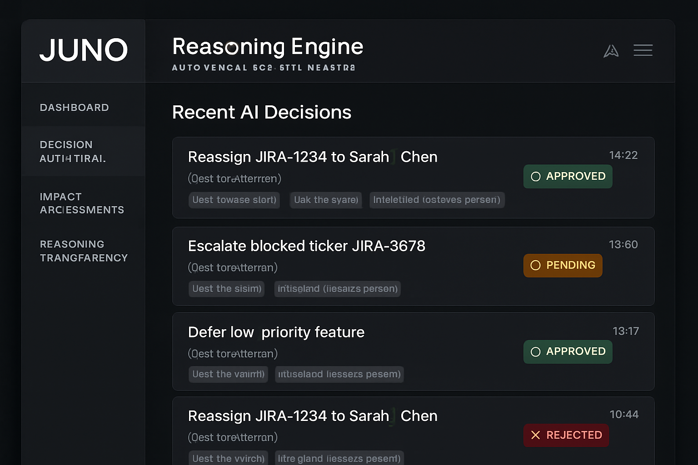
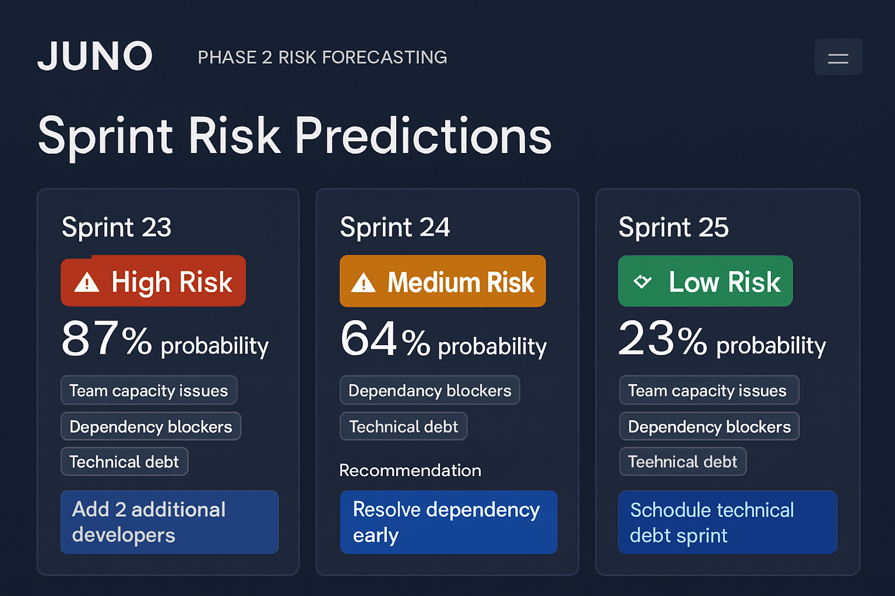
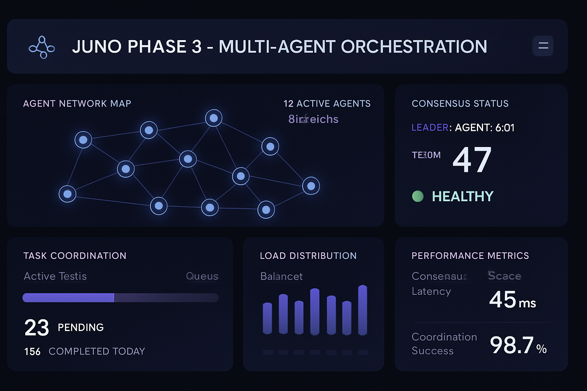

# Visual Interface Showcase (Mockup only)

*Professional engineering demonstration of JUNO's enterprise agentic AI platform*

### Phase 1: Analytics Foundation
*Foundational analytics and reporting capabilities with comprehensive Jira integration*

### Phase 2: Agentic AI Management
*Autonomous workflow management with memory systems and reasoning engines*

#### Main Dashboard Overview
*Comprehensive agentic AI monitoring with real-time metrics and autonomous decision tracking*

#### Memory Layer Interface
*Four-layer memory system monitoring: Episodic, Semantic, Procedural, and Working Memory*

#### Reasoning Engine Dashboard
*Autonomous decision tracking with confidence scores and transparent audit trails*

#### Risk Forecasting Interface
*Sprint risk predictions with probability scoring and mitigation recommendations*

### Phase 3: Multi-Agent Orchestration
*Distributed agent coordination with consensus protocols and fault tolerance*

### Phase 4: AI-Native Operations
*Autonomous operations with reinforcement learning and self-healing infrastructure*

